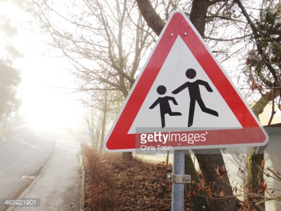
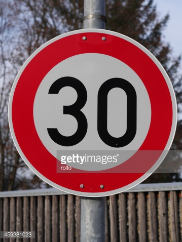
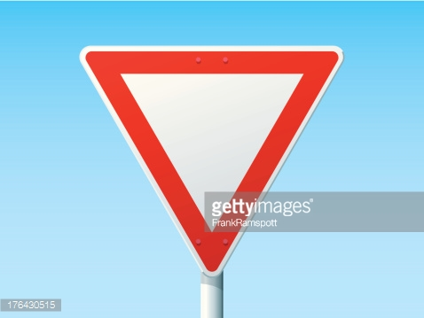

# **Traffic Sign Recognition** 

---

**Build a Traffic Sign Recognition Project**

The goals / steps of this project are the following:
* Load the data set (see below for links to the project data set)
* Explore, summarize and visualize the data set
* Design, train and test a model architecture
* Use the model to make predictions on new images
* Analyze the softmax probabilities of the new images
* Summarize the results with a written report

[//]: # (Image References)

[image1]: ./examples/visualization.jpg "Visualization"
[image2]: ./examples/grayscale.jpg "Grayscaling"
[image3]: ./examples/random_noise.jpg "Random Noise"
[image4]: ./test_images/1.jpg "Traffic Sign 1"
[image5]: ./test_images/2.jpg "Traffic Sign 2"
[image6]: ./test_images/3.jpg "Traffic Sign 3"
[image7]: ./test_images/4.jpg "Traffic Sign 4"
[image8]: ./test_images/5.jpg "Traffic Sign 5"

## Rubric Points
### Here I will consider the [rubric points](https://review.udacity.com/#!/rubrics/481/view) individually and describe how I addressed each point in my implementation.  

---
### Writeup / README

#### 1. Provide a Writeup / README that includes all the rubric points and how you addressed each one. You can submit your writeup as markdown or pdf. You can use this template as a guide for writing the report. The submission includes the project code.

You're reading it! and here is a link to my [project code](https://github.com/Eudie/CarND-Traffic-Sign-Classifier-Project/blob/master/Traffic_Sign_Classifier.ipynb)

### Data Set Summary & Exploration

#### 1. Provide a basic summary of the data set. In the code, the analysis should be done using python, numpy and/or pandas methods rather than hardcoding results manually.

I used the pandas library to calculate summary statistics of the traffic
signs data set:

* The size of training set is 34799
* The size of the validation set is 4410
* The size of test set is 12630
* The shape of a traffic sign image is (32, 32, 3)
* The number of unique classes/labels in the data set is 43

#### 2. Include an exploratory visualization of the dataset.

Here is an exploratory visualization of the data set. It is a bar chart showing the distribution of unique classes in the dataset. Using this chart we can observe if there is any class imbalance in our dataset.

![alt text][image1]

### Design and Test a Model Architecture

#### 1. Firstly I have normalized the images

#### 2. My final model consisted of the following layers:

| Layer         		|     Description	        					| 
|:---------------------:|:---------------------------------------------:| 
| Input         		| 32x32x3 RGB image(normalized)  				| 
| Convolution 5x5     	| 1x1 stride, valid padding, outputs 28x28x8	|
| RELU					|												|
| Max pooling	      	| 2x2 stride,  outputs 14x14x8  				|
| Convolution 5x5	    | 1x1 stride, valid padding, outputs 10x10x16  	|
| RELU          		|        								    	|
| Max pooling			| 2x2 stride,  outputs 5x5x16					|
| Fully connected		| Input = 400. Output = 256						|
| Dropout				| keep_prob = 0.3								|
| Fully connected		| Input = 256. Output = 128						|
| Dropout				| keep_prob = 0.3								|
| Output				| Input = 128. Output = 43						|
| Softmax   			|												|
|						|												|

 

#### 3. To train the model, I used Adam optimizer with learning rate of 0.001. I have use 128 aa batch size and trained model for 20 epochs

#### 4. My final model results were:
* validation set accuracy of 0.966
* test set accuracy of 0.952

I have followed an iterative approach:
* Started with LeNet architecture. Accuracy was not upto the mark
* Increased number of convulution filters to 16 and 64. Probably overfitted as getting extreame probabilities even for false classifications
* Kept the convolve filter same and increased the number of neuron in fully connected layers. Still overfitting
* Added dropout with keep_prob 0.3.

 

### Test a Model on New Images

#### 1. Choose five German traffic signs found on the web and provide them in the report. For each image, discuss what quality or qualities might be difficult to classify.

Here are five German traffic signs that I found on the web:

This image might be difficult to classify may be because of background trees and may because sign is not at center

This image might be difficult to classify may be because of broken top or high intensity

This image might be difficult to classify may be because of after the image might get distroted after resizing to 32x32

This image might be difficult to classify may be because of so many similar looking classes

This image might be difficult to classify may be because of watermark

#### 2. Here are the results of the prediction:

| Image			                         |     Prediction	        					| 
|:--------------------------------------:|:--------------------------------------------:| 
| Road work      		                 | Road work   									| 
| Speed limit (30km/h)    			     | Speed limit (30km/h)							|
| Yield					                 | Yield										|
| Right-of-way at the next intersection  | Right-of-way at the next intersection		|
| Children crossing			             | Speed limit (30km/h)     					|

The model was able to correctly guess 4 of the 5 traffic signs, which gives an accuracy of 80%. This compares favorably to the accuracy on the test set of 0.952

#### 3. While predicting the right classes probability was close to one. But probility for the false prediction prediction are as follows

The actual class is 'Children crossing'

| Probability         	|     Prediction	        					| 
|:---------------------:|:---------------------------------------------:| 
| 0.46248937       		| Speed limit (30km/h)   						| 
| 0.17791809   			| Speed limit (20km/h) 							|
| 0.15212053			| General caution								|
| 0.07850559  			| Speed limit (70km/h)			 				|
| 0.02501689		    | Traffic signals      							|

