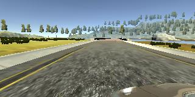

# **Behavioral Cloning** 

---

**Objective**

The goals / steps of this project are the following:
* Use the simulator to collect data of good driving behaviour
* Build, a convolution neural network in Keras that predicts steering angles from images
* Train and validate the model with a training and validation set
* Test that the model successfully drives around track one without leaving the road
* Summarize the results with a written report


---
### Files Submitted & Code Quality

#### 1. My project includes the following files:
* model.py containing the script to create and train the model
* drive.py for driving the car in autonomous mode
* model.h5 containing a trained convolution neural network 
* video.mp4 the driving result of one lap
* writeup_report.md summarizing the results


#### 2. Using the Udacity provided simulator and my drive.py file, the car can be driven autonomously around the track by executing 
```sh
python drive.py model.h5
```

#### 3. The model.py file contains the code for training and saving the convolution neural network. The file shows the pipeline I used for training and validating the model, and it contains comments to explain how the code works.

### Model Architecture and Training Strategy

#### 1. Architecture:

   * Four stacked convolutional layers with RELU activation and followed by maxpooling:
      * Filter: 8, Stride: (5,5)
      * Filter: 32, Stride: (5,5)
      * Filter: 64, Stride: (3,3)
      * Filter: 128, Stride: (3,3)


   * After flattening, three fully connected layers before output layer:
      * 256
      * 128
      * 64
        
        
#### 2. Used dropout of 20% in dense layers and chose appropriate epochs based on validation loss to tackle overfitting

#### 3. Used Adam Optimizer to train the model

#### 4. Used a combination of centre, left and the right camera then also used augmented images by flipping them horizontally to generalize more.


### Model Architecture and Training Strategy

#### 1. Solution Design Approach

I have started with the vggnet architecture but the model not even able to take the first turn. Then I started increasing convolution filter and layers. I thought vggnet works well for small images and as our image size is big it might require more complex features.

The model started working well on simulation but more left bias and unable to take sharp turns. To tackle this problem I have used image augmentation over centre, left and right camera images.

#### 2. Final Model Architecture
First I am doing normalization and cropping of images.

The final model architecture (model.py lines 106-130) consisted of four stacked convolutional layers with RELU activation and followed by max-pooling after that I have used 3 dense layers with dropout before predicting output

| Layer | Output Shape | Param # | Stride |
|---|---:|---:|:---:|
| Input  | 160, 320, 3 | 0 | -  |
| Normalization | 160, 320, 3  | 0 |-  |
| Cropping |  65, 320, 3 | 0 | -  |
| Convolution 5x5 | 61, 316, 8  | 608 | (2,2) |
| MaxPooling | 30, 158, 8  | 0  |-  |
| Convolution 5x5 | 26, 154, 32  | 6432 | (2,2) |
| MaxPooling | 13, 77, 32  | 0  |-  |
| Convolution 3x3 | 11, 75, 64  | 18496 | (2,2) |
| MaxPooling | 5, 37, 64  | 0  |-  |
| Convolution 3x3 | 3, 35, 128 | 73856 | (2,2)  |
| MaxPooling  | 1, 17, 128 | 0  |-  |
| Flatten | 2176 | 0 |-  |
| Dense  | 512 | 1114624  |-  |
| Dropout  | 512   | 0  |-  |
| Dense  | 128 | 65664  |-  |
| Dense  | 64 | 8256  |-  |
| Dense  | 1 | 65  |-  |

Total params: 1,288,001

#### 3. Creation of the Training Set & Training Process

To capture good driving behaviour, I first recorded four laps on track one using centre lane driving. But since I am not a good driver, I got lots of data point where the car has to recover from edges and has to make sharp turns. I kept on collecting more data so that model can learn both normal and recovery behaviour.

After the collection process, I did the preprocessing by normalizing and cropping only the important part of the images.

I have used left, center and right camera images with steering correction:


**Steering: 0.54**


**Steering: 0.54+0.2**




**Steering: 0.54-0.2**


After that I flipped the images and changing the sign of steering direction, to get more robust data.

**Steering: 0.34**


**Steering: -0.34**


I finally randomly shuffled the dataset and put 20% of the data into a validation set. 

I used this training data for training the model. The validation set helped determine if the model was over or underfitting. The ideal number of epochs was 1 for this model. I used an Adam optimizer so that manually training the learning rate wasn't necessary.